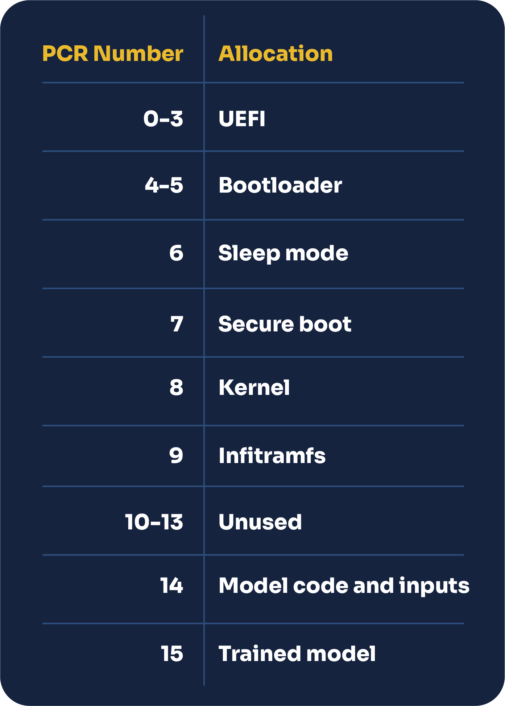

[Trusted Platform Modules](https://en.wikipedia.org/wiki/Trusted_Platform_Module) (TPMs) are at the core of AICert, enabling us to cryptographically bind a model’s weights to its training code and data, as well as the software stack of the machine it was trained on.

In this section, we will cover:

+ How TPMs work
+ How we leverage them in AICert
+ The hardware/software stack we provide with AICert

### Trusted Platform Modules (TPMs)

#### Overview

TPMs can be used to ensure the integrity of a whole software supply chain. Such devices have the property of being able to attest the whole stack used for producing the model, from the UEFI, all the way to the code and data, through the OS.

The TPM PCRs (Platform Configuration Registers) are a set of registers within the TPM that store measurements of system configuration and integrity. They can be considered a log of the system state, capturing the integrity of various components during the boot process and other critical stages. The PCRs are typically used to attest to the integrity of a system or to verify that the system has not been tampered with.

When a system boots, various measurements are taken, such as hashes of firmware, boot loaders, and critical system files. These measurements are then stored in the TPM PCRs. The values stored in the PCRs can then be compared against known values.

We can request a signed quote from the TPM which contains these PCR values and is signed by the TPM's Attestation Key (AK), which is derived from a tamper-proof TPM Endorsement Key (EK), and thus cannot be falsified by a third party.

Measuring the whole software stack and binding the inputs used in the training process and the final weights produced (by registering them to the last two PCRs) allows the derivation of certificates that contain irrefutable proof of model provenance. 

#### Usage in AICert

To see how it works in practice, let’s see how AICert uses TPMs to prove a specific code and data were loaded, and how they were used to produce a specific model.

**Software stack**

We provide a base image containing all software elements up to the server application that will execute the code on the training data. This base image is fixed and can be publicly audited.

At the boot stage, the stack is loaded piece by piece, starting with the UEFI. The TPM will measure and store each of these elements in their corresponding PCR. 

**Inputs**

We then download the project repository and any resources as specified in the AICert config file. These inputs are hashed and stored in PCR14.

**Outputs**

After performing training, we hash the outputs and store these hashes in PCR15.

AICert will then request a “quote”, containing all these measurements, which is signed by a hardware-derived key verified by the Cloud provider.

#### Verification

When end users use the `verify()` method provided in our AICert Python library, AICert will check the values of each PCR in our AICert proof file against known values. This allows us to verify the full software stack used by AICert.

However, the hashes in PCR14 and PCR15 are not known values to AICert, so end users should verify these manually by comparing the values in our AICert proof file against known SHA256 (for GitHub commits) or SHA1 hashes (for other input files) for the input data.

#### AICert Architecture

AICert is composed of the following elements:

+ **Base image** containing our selected OS for reproducibility
+ **Server** on top that takes inputs specified in the AICert config file, applies the algorithm to the data and uses TPM primitives to create a certificate
+ **CLI tool** to provision the VM with our predefined hardware/software stack, launches AI builder’s program and returns outputs and proof files to them
+ **Client-side Python SDK** to verify and inspect AI certificates

#### Workflow of AICert

When the AI builder launches the `aicert` CLI command. Under the hood, AICert will:

+ Provision a VM with the correct hardware/software stack, PCR registers 0-13 will be updated at boot time
+ Hash input values and register them to PCR14
+ Build a container with all the necessary inputs
+ Execute main.py code or alternative entrypoint command
+ Hash outputs and register them to PCR15
+ Request a signed quote from the Cloud provider containing all PCR values
+ Standardize quote details and return AI certificate to the end user

When the end user verifies the certificate, AICert will:

+ Verify the certificate comes from a genuine TPM and that the expected software stack has indeed been loaded, all the way up to our server.

The end user can then inspect input and output hashes manually.

> Note that AICert can only certify that a specific piece of code was executed on some data. The content of the code and data itself have to be verified independently.

## Trust model

### Overview

AICert makes it easy for AI builders to spin a machine with the right hardware/software stack by leveraging Cloud infrastructure (e.g. Azure). We will therefore include the Cloud provider in the Trust Model here. 

Therefore, there are three parties present:
+ The **AI builder** who is responsible for the training code and data
+ **AICert**, which is responsible for the server-side tooling, including the base OS image, the server to launch the training code and client SDK to verify those elements
+ The **Cloud provider** who is responsible for administrating the machines and providing the virtual TPM

In the current climate, there is blind trust in the AI builder. If they are compromised, malicious backdoors can be inserted into their models, and there is no way for end users to verify the AI models they provide.

With AICert, we can remove this need for blind trust in the AI builder, as now there is a cryptographic binding between the weights and the data and code, using the PCR values requested by our server.

We should however trust that AICert does not contain backdoors, either in the base OS we provide, the HTTP server in charge of running user scripts in containers and registering the PCR values, and the client-side SDK in charge of the verification. AICert is open-source and should be inspected by the community.

The Cloud provider who operates the platform is trusted.